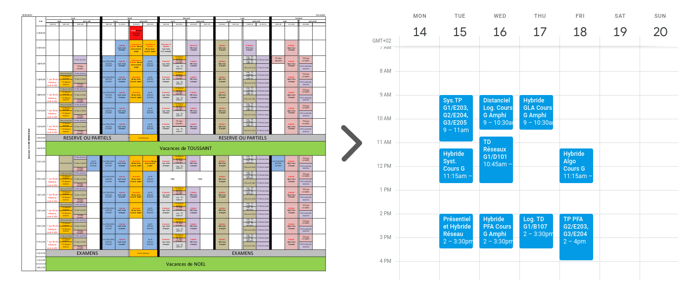

#  Timetable into Google calendar

> Quickly convert your student timetable into google calendar events.


   

## Table of Contents

> If your `README` has a lot of info, section headers might be nice.

- [Installation](#installation)
- [Usage](#usage)
- [Example](#example)
- [FAQ](#faq)
- [Contributing](#contributing)
- [License](#license)

---

## Installation

```bash
git clone https://github.com/lucasmrdt/edt-to-google-calendar
cd edt-to-google-calendar
pip install -r requirements.txt --user
```

## Usage

```bash
> ./edt2google -h

usage: edt2google [-h] [--algo {g1,g2,g3,g4,g5,g6}] [--log {g1,g2,g3,g4,g5,g6}] [--pfa {g1,g2,g3,g4,g5,g6}]
                  [--gla {g1,g2,g3,g4,g5,g6}] [--net {g1,g2,g3,g4,g5,g6}] [--sys {g1,g2,g3,g4,g5,g6}]
                  [--comp {g1,g2,g3,g4,g5,g6}] [--oa {g1,g2,g3,g4,g5,g6}] [--output OUTPUT]
                  file

Quickly convert your student timetable into google calendar events.

positional arguments:
  file                  student timetable in .xlsx

optional arguments:
  -h, --help            show this help message and exit
  --algo {g1,g2,g3,g4,g5,g6}
                        algorithm group
  --log {g1,g2,g3,g4,g5,g6}
                        logical group
  --pfa {g1,g2,g3,g4,g5,g6}
                        pfa group
  --gla {g1,g2,g3,g4,g5,g6}
                        gla group
  --net {g1,g2,g3,g4,g5,g6}
                        network group
  --sys {g1,g2,g3,g4,g5,g6}
                        system group
  --comp {g1,g2,g3,g4,g5,g6}
                        compilation group
  --oa {g1,g2,g3,g4,g5,g6}
                        O&A group
  --output OUTPUT       .csv output file

```

## Example

```bash
> ./edt2google --pfa g3 --gla g1 --sys g2 --net g1 --log g1 --algo g1  assets/paris-saclay-l3-info.xlsx

Converting 'assets/paris-saclay-l3-info.xlsx' into google calendar events with :
algo=g1, log=g1, pfa=g3, gla=g1, net=g1, sys=g2

✅ Your 'timetable.csv' file is ready to be imported on google calendar.

```

---

## FAQ

- How I can import my generated google calendar events ?
    - Look at [here](https://support.google.com/calendar/answer/37118?co=GENIE.Platform%3DDesktop&hl=en). *I advice you to import all theses events into a new calendar.*

- How to convert my timetable `.pdf` file into `.xlsx` ?
    - I recommend to use [pdftoexcelonline](https://www.pdftoexcelonline.com/). It works well for ParisSaclay timetable.

---

## Contributing

- [ ] Test on mac
- [ ] Test on windows
- [ ] Abstract timetable parsing

Fell free to add more usefull features, test it and report issues.

- You should probably resize their picture using `?s=200` at the end of the image URL.

## Support

Reach out to me at one of the following places!

- Website at <a href="https://lucas-marandat.fr" target="_blank">`lucas-marandat.fr`</a>
- LinkedIn at <a href="https://www.linkedin.com/in/lucasmrdt/" target="_blank">`@lucasmrdt`</a>

## License

[](http://badges.mit-license.org)

- **[MIT license](http://opensource.org/licenses/mit-license.php)**

